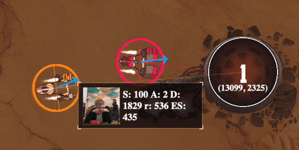
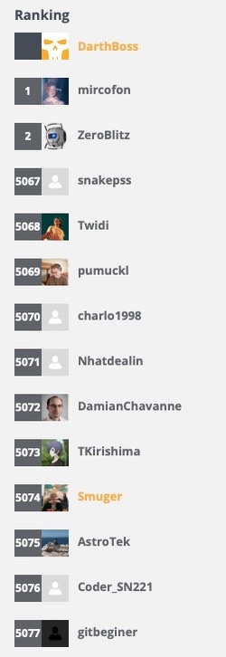
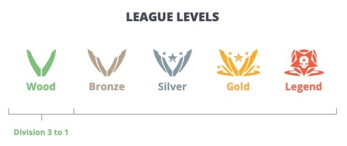

# Progress:

## Features implemented:
### **Adaptive apex** (Move target position based on approach angle and speed)

### **Checkpoint memory** (Add checkpoint positions to the list and pre-turn on second lap)

## Things to work on:
- Higher corner speed
- Better use of shield

# Leaderboard

## All Leagues
